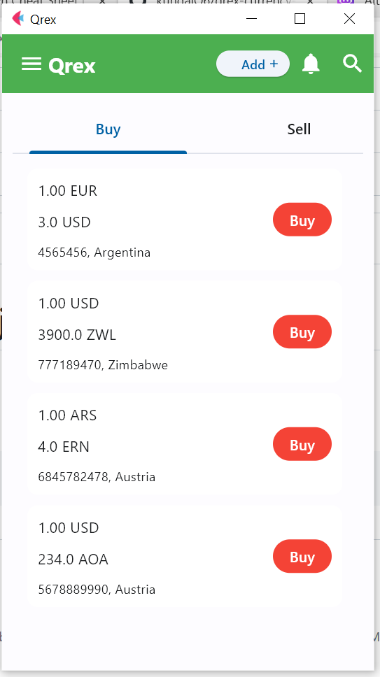

## Qrex currency exchange app experiment with python (django and flet)
the project is was for testing the scalability of [python-flet](https://flet.dev/) which is a module for building Flutter apps in Python




## How to run flet app
```bash
git clone https://github.com/kundaiO6/qrex-currency-exchange.git
cd qrex-currency-exchange
pip install django flet
flet run
```
## How to run the django app
```bash
cd xchange
python manage.py runserver
```
you are good to go!